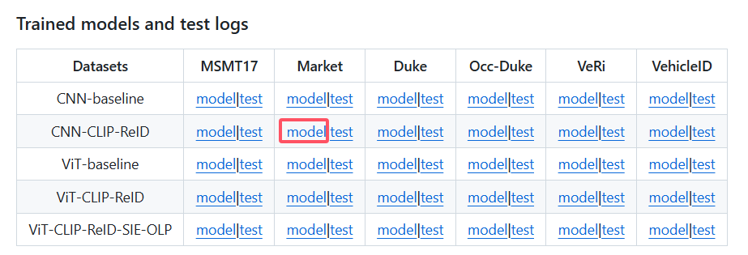

# YPCRer — Pedestrian Re-Identification System Based on YOLOv8 and CLIP-ReID

---
## 📚 项目简介

YPCRer 是在 YoloSide v2 项目基础上进行的再开发，在原有的目标检测功能上进行改动。引入CLIP-ReID，新增了数据管理（增删改查）、行人重识别和任务记录功能。此次项目是为了学习目标检测和重识别技术，同时学习使用了QT的Pyside6进行桌面应用开发。我也有相关的资料可以找我QQ：1379239710。

---
## ✏️ 参考项目链接

### CLIP-ReID 项目
**源码链接**：
- Github：[https://github.com/Syliz517/CLIP-ReID](https://github.com/Syliz517/CLIP-ReID)

### 界面功能等参考
**链接**：
- Github：[https://github.com/Jai-wei/YOLOv8-PySide6-GUI](https://github.com/Jai-wei/YOLOv8-PySide6-GUI)
- B站：[YoloSide V2.0 ~ yolov8 pyside6 可视化界面 gui 目标检测 毕业设计](https://www.bilibili.com/video/BV1Cb411f7cw/?spm_id_from=333.337.search-card.all.click&vd_source=eb243edd059640e52705bf18f8a0d6a8)

### YOLOv8
- Github：[ultralytics](https://github.com/ultralytics/ultralytics?tab=readme-ov-file)
---
## 🎦 视频展示
- B站：[YPCRer——基于Yolov8和CLIP-ReID的行人重识别系统](https://www.bilibili.com/video/BV1oTzGYPEsn/?spm_id_from=333.337.search-card.all.click&vd_source=eb243edd059640e52705bf18f8a0d6a8)

---
## 💻 核心技术栈

### 后端：
- 数据库：MySQL 8.0

### 前端
- Pyside6

### 目标检测技术
- YOLOv8

### 重识别技术
- CLIP-ReId

---

## 🔨 开发环境

- 操作系统：Windows 11
- 集成开发工具：Pycharm
- 版本控制工具：Git
- 环境管理：Anaconda （Python 版本：3.11）

---

## 📊 代码架构


---

## ☝️ 使用
- 模型准备：下载CLIP-ReId和YOLOv8的模型（模型太大没有上传），要根据模型进行略微修改。 因为clip-reid的模型太大了上传不了，所以项目的代码架构中reid-models这个文件夹没有需要自己创建，然后放入模型。 模型的话需要你自己去上面参考项目CLIP-ReID 项目的主页下载,项目里面使用的是Market1501的模型（因为其它模型参数也不一样，需要自己修改参数才能跑其它模型）

- 安装环境

```
conda create -n test(虚拟环境名称，可更换)
conda activate test

下面是安装pytorch，要先安装cuda（根据自己的电脑来，不会可以查教程）
(pytorch 2.6版本以上用不了推荐2.5.0)
conda install pytorch==2.5.0 torchvision torchaudio pytorch-cuda=12.1 -c pytorch -c nvidia

pip install yacs
pip install timm
pip install scikit-image
pip install tqdm
pip install ftfy
pip install regex

下面的版本要对应（python为3.11.7版本，下面为适配的版本，版本不一样大概率报错）
pip install ultralytics==8.0.48
pip install pyside6==6.4.2


```
---
## 🎀 界面展示

登录：


主页：


数据管理：


目标检测：


重识别：

